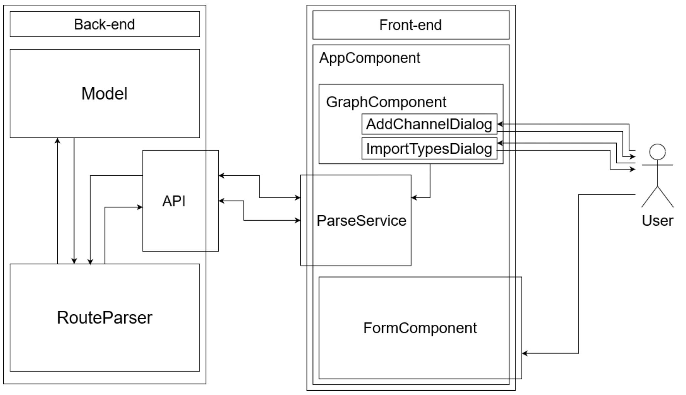

# MR - Mismatch Resolver
**MR** provides an implementation of the design-time methodology proposed in 

>Soldani J, Paoletti R, Brogi A. 
>*Pattern-Based Resolution of Integration Mismatches in Enterprise Applications*.
>Submitted for publication

Please cite the paper if you wish to reuse **MR** in your research.

## About
Given an EIP-based integration architecture specified in the Java DSL of Apache Camel, **MR** can automatically identify the message type mismatches therein, viz., the communication channels connecting a software component to another, with the source component sending a message of a type that is not compatible with that expected by the target component. 
Identified mismatches are highlighted in *red* in **MR**'s gui.

**MR** also enables getting recommendation on how to refactor an integration architecture to resolve the message type mismatches therein.
Mismatch resolution is based on introducing novel EIPs to adapt the message sent by a source component to match the type expected by the target component.
Suggested refactorings are highlighted in *yellow* in **MR**'s gui.

The actual implementation of refactorings (viz., the introduction of EIPs) is then left to the application developers.

## Using MR
**MR** can be dowloaded by cloning its GitHub repository:
```
git clone https://github.com/di-unipi-socc/MR.git
```
After moving to the newly created `MR` folder, it can be started by running its Docker-based deployment:
```
docker-compose up -d
```
(with `-d` used to load the Docker Compose deployment in background). This will deploy

* an instance of the **frontend**, reachable at port `5000` of the host where **MR** is deployed, and
* an instance of the **backend**, reachable at port `8080` of the host where **MR** is deployed.

This is done under the assumption that such ports are available on the host. To change them, in case they are not available, please updated the [Docker Compose file](docker-compose.yml).

After this, an instance of **MR**'s GUI will be reachable at
```
https://HOST:5000
```
where `HOST` stands for the hostname/IP address of the host where **MR** got deployed (e.g., `localhost` if deployed on the same machine trying to access it).

To stop a running deployment of **MR**, please issue the command
```
docker-compose down
```
in the folder `MR` created by cloning the repository of **MR**.

## Implementation of MR
**MR** consists of two main components:
* A web-based **frontend** providing a GUI for importing an integration architecture, triggering its analysis, and visualising the analysis' results. 
It is implemented in Angular and its sources are publicly available in the [frontend](frontend) folder.
* A **backend** HTTP API implementing the logic for identifying and resolving type mismatches in integration architectures.
It is implemented in Spring and its sources are publicly available in the [backend](backend) folder.

